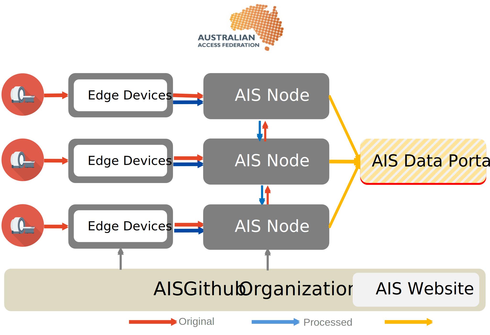
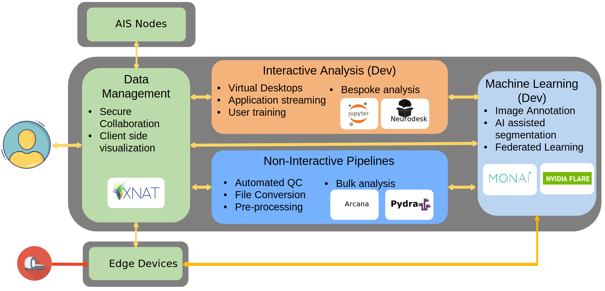


<a class="btn btn-lg btn-primary me-3 mb-4" href="/docs/">
  Learn More <i class="fas fa-arrow-alt-circle-right ms-2"></i>
</a>



{}
The Australian Imaging Service (AIS) is a national platform for secure imaging (predominately clinical, preclinical, veterinary, and archaeological) management, analysis, informatics, and machine learning, led by the University of Sydney in partnership and with co-investment from the Australian Research Data Commons (ARDC), the National Imaging Facility (NIF), and 10 other universities and research organizations.

Our mission is to increase research reproducibility and drive the adoption of innovative but trusted analysis techniques. We aim to create a unified service underpinning all imaging research conducted by Australians, both nationally and abroad, on which more specific research and development programs can be built.
{}

{}


NCRIS funded national platform for collaborative imaging research


Integration with imaging facilities and clinical sites


Secure, audited data management, access, and de-identification


Browser accessible viewing, annotation, and analysis


One-click reproducible pipeline library, curated collection and custom developed


{}

{}
{}
Upload and process data from clinical sites and imaging facilities
Linked data repositories with shared library of containerised pipelines and analysis tools deployed on Kubernetes
Open fronted for findable metadata (opt-in)
Single landing page and documentation
 Shared cloud native codebase on GitHub
{}

{}

{}

AIS operates as a federation, co-maintaining a central set of software repositories with each partner institution operating their own node matching their local governance, infrastructure, and cost structures. AIS integrates with imaging devices in a hub and spoke model, with each node integrating their local academic and clinical equipment, with data able to be transferred between nodes to facilitate multi-site imaging studies. By adopting and standardizing user authentication, instrument integration, data ontologies, and mature software tools, AIS allows researchers and facilities to focus more of their time on innovation and allows reuse of national datasets by building a provenance trail from image capture to manipulation
{}

{}
# Data centric computing - Four integrated capability areas

{}

{}
# Funding and acknowledgements

{}
